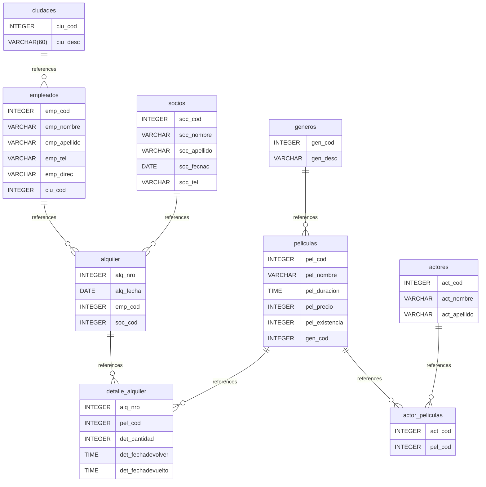

# Diagrama de entidad relación
## Ejercicio alquiler-db
## INDICE

- [Diagrama de entidad relación](#diagrama-de-entidad-relación)
	- [Ejercicio alquiler-db](#ejercicio-alquiler-db)
	- [INDICE](#indice)
	- [Introduction](#introduction)
	- [Database type](#database-type)
	- [Table structure](#table-structure)
		- [empleados](#empleados)
		- [alquiler](#alquiler)
		- [peliculas](#peliculas)
		- [detalle\_alquiler](#detalle_alquiler)
			- [Indexes](#indexes)
		- [ciudades](#ciudades)
		- [socios](#socios)
		- [generos](#generos)
		- [actores](#actores)
		- [actor\_peliculas](#actor_peliculas)
			- [Indexes](#indexes-1)
	- [Relationships](#relationships)
	- [Database Diagram](#database-diagram)

## Introduction

## Database type

- **Database system:** PostgreSQL
## Table structure

### empleados

| Name        | Type          | Settings                      | References                    | Note                           |
|-------------|---------------|-------------------------------|-------------------------------|--------------------------------|
| **emp_cod** | INTEGER | 🔑 PK, not null, unique, autoincrement | fk_empleados_emp_cod_alquiler | |
| **emp_nombre** | VARCHAR | not null |  | |
| **emp_apellido** | VARCHAR | not null |  | |
| **emp_tel** | VARCHAR | null |  | |
| **emp_direc** | VARCHAR | null |  | |
| **ciu_cod** | INTEGER | not null |  | |

### alquiler

| Name        | Type          | Settings                      | References                    | Note                           |
|-------------|---------------|-------------------------------|-------------------------------|--------------------------------|
| **alq_nro** | INTEGER | 🔑 PK, not null, unique, autoincrement | fk_alquiler_alq_nro_detalle_alquiler | |
| **alq_fecha** | DATE | not null |  | |
| **emp_cod** | INTEGER | not null |  | |
| **soc_cod** | INTEGER | not null |  | |

### peliculas

| Name        | Type          | Settings                      | References                    | Note                           |
|-------------|---------------|-------------------------------|-------------------------------|--------------------------------|
| **pel_cod** | INTEGER | 🔑 PK, not null, unique, autoincrement | fk_peliculas_pel_cod_detalle_alquiler,fk_peliculas_pel_cod_actor_peliculas | |
| **pel_nombre** | VARCHAR | not null |  | |
| **pel_duracion** | TIME | not null |  | |
| **pel_precio** | INTEGER | null |  | |
| **pel_existencia** | INTEGER | not null |  | |
| **gen_cod** | INTEGER | not null |  | |

### detalle_alquiler

| Name        | Type          | Settings                      | References                    | Note                           |
|-------------|---------------|-------------------------------|-------------------------------|--------------------------------|
| **alq_nro** | INTEGER | not null, autoincrement |  | |
| **pel_cod** | INTEGER | not null |  | |
| **det_cantidad** | INTEGER | null |  | |
| **det_fechadevolver** | TIME | null |  | |
| **det_fechadevuelto** | TIME | null |  | |

#### Indexes
| Name | Unique | Fields |
|------|--------|--------|
| detalle_alquiler_index_0 |  | alq_nro, pel_cod |
### ciudades

| Name        | Type          | Settings                      | References                    | Note                           |
|-------------|---------------|-------------------------------|-------------------------------|--------------------------------|
| **ciu_cod** | INTEGER | 🔑 PK, not null, unique, autoincrement | fk_ciudades_ciu_cod_empleados | |
| **ciu_desc** | VARCHAR(60) | not null |  | |

### socios

| Name        | Type          | Settings                      | References                    | Note                           |
|-------------|---------------|-------------------------------|-------------------------------|--------------------------------|
| **soc_cod** | INTEGER | 🔑 PK, not null, unique, autoincrement | fk_socios_soc_cod_alquiler | |
| **soc_nombre** | VARCHAR | not null |  | |
| **soc_apellido** | VARCHAR | not null |  | |
| **soc_fecnac** | DATE | not null |  | |
| **soc_tel** | VARCHAR | null |  | |

### generos

| Name        | Type          | Settings                      | References                    | Note                           |
|-------------|---------------|-------------------------------|-------------------------------|--------------------------------|
| **gen_cod** | INTEGER | 🔑 PK, not null, unique, autoincrement | fk_generos_gen_cod_peliculas | |
| **gen_desc** | VARCHAR | not null |  | |

### actores

| Name        | Type          | Settings                      | References                    | Note                           |
|-------------|---------------|-------------------------------|-------------------------------|--------------------------------|
| **act_cod** | INTEGER | 🔑 PK, not null, unique, autoincrement | fk_actores_act_cod_actor_peliculas | |
| **act_nombre** | VARCHAR | not null |  | |
| **act_apellido** | VARCHAR | not null |  | |

### actor_peliculas

| Name        | Type          | Settings                      | References                    | Note                           |
|-------------|---------------|-------------------------------|-------------------------------|--------------------------------|
| **act_cod** | INTEGER | not null, autoincrement |  | |
| **pel_cod** | INTEGER | not null |  | |

#### Indexes
| Name | Unique | Fields |
|------|--------|--------|
| actor_peliculas_index_1 |  | act_cod, pel_cod |
## Relationships

- **empleados to alquiler**: one_to_many
- **peliculas to detalle_alquiler**: one_to_many
- **alquiler to detalle_alquiler**: one_to_many
- **ciudades to empleados**: one_to_many
- **socios to alquiler**: one_to_many
- **generos to peliculas**: one_to_many
- **actores to actor_peliculas**: one_to_many
- **peliculas to actor_peliculas**: one_to_many

## Database Diagram

