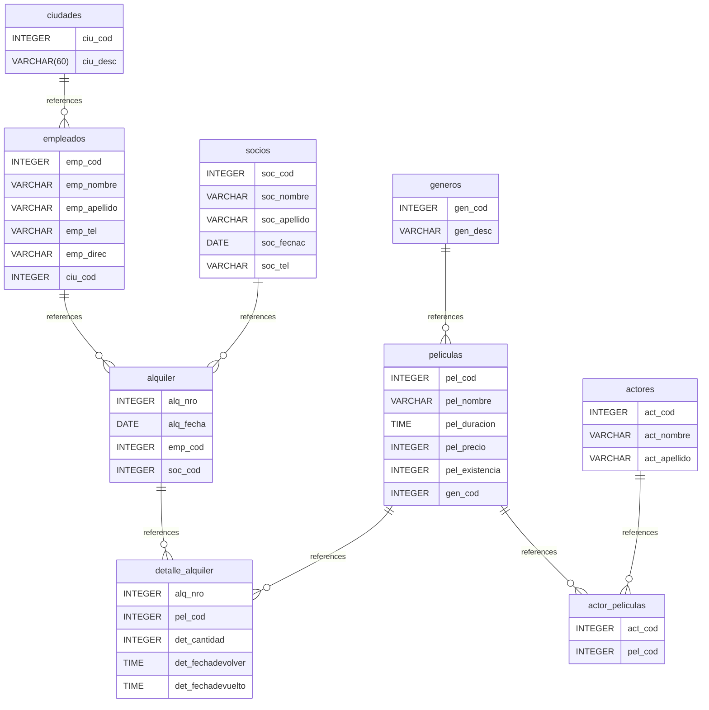

# Diagrama de entidad relación
## Ejercicio alquiler-db

```mermaid
erDiagram
	empleados ||--o{ alquiler : references
	peliculas ||--o{ detalle_alquiler : references
	alquiler ||--o{ detalle_alquiler : references
	ciudades ||--o{ empleados : references
	socios ||--o{ alquiler : references
	generos ||--o{ peliculas : references
	actores ||--o{ actor_peliculas : references
	peliculas ||--o{ actor_peliculas : references

	empleados {
		INTEGER emp_cod
		VARCHAR emp_nombre
		VARCHAR emp_apellido
		VARCHAR emp_tel
		VARCHAR emp_direc
		INTEGER ciu_cod
	}

	alquiler {
		INTEGER alq_nro
		DATE alq_fecha
		INTEGER emp_cod
		INTEGER soc_cod
	}

	peliculas {
		INTEGER pel_cod
		VARCHAR pel_nombre
		TIME pel_duracion
		INTEGER pel_precio
		INTEGER pel_existencia
		INTEGER gen_cod
	}

	detalle_alquiler {
		INTEGER alq_nro
		INTEGER pel_cod
		INTEGER det_cantidad
		TIME det_fechadevolver
		TIME det_fechadevuelto
	}

	ciudades {
		INTEGER ciu_cod
		VARCHAR(60) ciu_desc
	}

	socios {
		INTEGER soc_cod
		VARCHAR soc_nombre
		VARCHAR soc_apellido
		DATE soc_fecnac
		VARCHAR soc_tel
	}

	generos {
		INTEGER gen_cod
		VARCHAR gen_desc
	}

	actores {
		INTEGER act_cod
		VARCHAR act_nombre
		VARCHAR act_apellido
	}

	actor_peliculas {
		INTEGER act_cod
		INTEGER pel_cod
	}
```